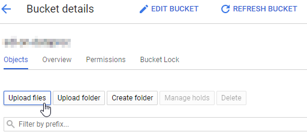
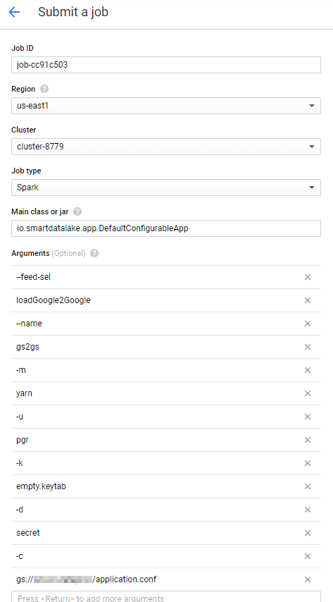

# Run on Google Dataproc

Smart Data Lake can be executed on the Google Cloud platform using their Dataproc service.
The following steps will show you how to set everything up and start a first data load.

1.  Create a new Storage Bucket to hold the jar file and any input / output of your feeds. 
    We'll also store the application.conf in the same bucket.  
      
1.  Build the project (with activated profile fat-jar) if you haven't done that already, 
    then upload the smartdatalake-\<version>-jar-with-dependencies.jar to the bucket. The easiest way is through the Cloud Console.
    
    

1.  Also copy yor application.conf to the bucket that way.
 
    For a simple test that loads from your Google Storage bucket and writes back to it, you can use the following sample application.conf:
    ```hocon
    connections {
    }
    
    dataObjects {
     
      ab-csv-google {
        type = CsvFileDataObject
        path = "gs://yourbucketname/AB_NYC_2019.csv"
        csv-options {
          delimiter = ","
          escape = "\\"
          header = "true"
          quote = "\""
        }
      }
    
      ab-reduced-csv-google {
        type = CsvFileDataObject
        path = "gs://yourbucketname/~{id}/nyc_reduced.csv"
        csv-options = {
          delimiter = ","
          escape = "\\"
          header = "true"
          quote = "\""
        }
      }
    
    }
    
    actions {
    
      loadGoogle2Google {
        type = CopyAction
        inputId = ab-csv-google
        outputId = ab-reduced-csv-google
        metadata {
          feed = ab-google
        }
      }
    
    }
    ```        
    Make sure to replace `yourbucketname` in the data objects ab-csv-google and ab-reduced-csv-google with your real bucket name. 
    As you can see in the examples, you can use the prefix gs:// directly to point to files in a Google Storage bucket.

1.  To run the sample feed, also copy the example resource file AB_NYC_2019.csv to the buckets root directory.

    At this point you should have three files in your bucket: the jar, the application.conf and the csv file.

1.  Create a new Dataproc Cluster. 
    Choose a configuration that matches your needs. 
    While you can basically use any configuration for Cluster Mode (even "Single Node" with 1 master and 0 workers), 
    the master node should not be too small so chose at least a n1-standard-4. 
    Anything lower might result in errors, even for small jobs.

    Make sure you use the latest Cloud Dataproc image (latest tested version is 1.4).

1.  Create a job and start it. Again, the easiest way to start is through the Google Cloud Console. 
    ```
    Main class: io.smartdatalake.app.DefaultConfigurableApp
    Arguments: parameters and values on seperate lines, see README
    ```  
    

1.  Click on Submit and wait for the job to finish. If everything worked as expected, your output should have been written to your bucket:

    
